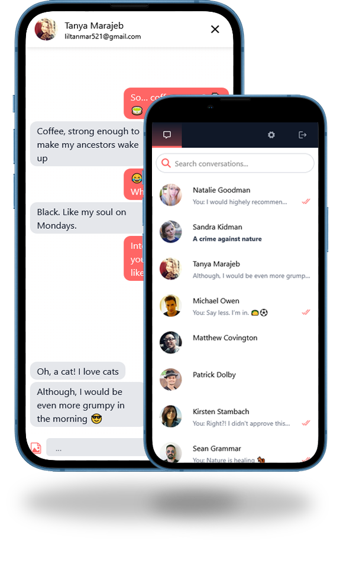

    

 

<a href="https://pownprojects.site/aeora" style="text-decoration: underline; font-weight: bold;">Aeora</a>
 is a modern messaging application built with the **MERN stack** and powered by Socket.IO for real-time communication. It offers a seamless user experience with emoji support, mobile responsiveness, and smooth transitions.

---

## 🚀 Features

- 🔐 User Authentication with JWT
- 💬 Real-time messaging using Socket.IO
- 📁 Image files handling by AWS S3
- 🌐 Responsive layout for mobile and desktop
- 📁 Firebase google and facebook login authentication
- 😀 Emoji picker with emoji-mart
- 📲 Swipeable conversations with Swiper
- 🔄 Routing and protected pages with React Router
- 💾 Secure password handling using bcrypt

---

## 🛠️ Technologies Used

### Frontend

- **React** with **TypeScript**
- **Socket.IO-client** for realtime features
- **React Router DOM** for navigation
- **Swiper** for swipeable UI elements
- **emoji-mart** for emojis
- **Tailwindcss** for styling

### Backend

- **Node.js** + **Express** with **TypeScript**
- **MongoDB** with Mongoose
- **Socket.IO** for realtime communication
- **Firebase SDK**
- **bcrypt** for password hashing
- **jsonwebtoken** (JWT) for authentication

---

#### Screenshots

    

